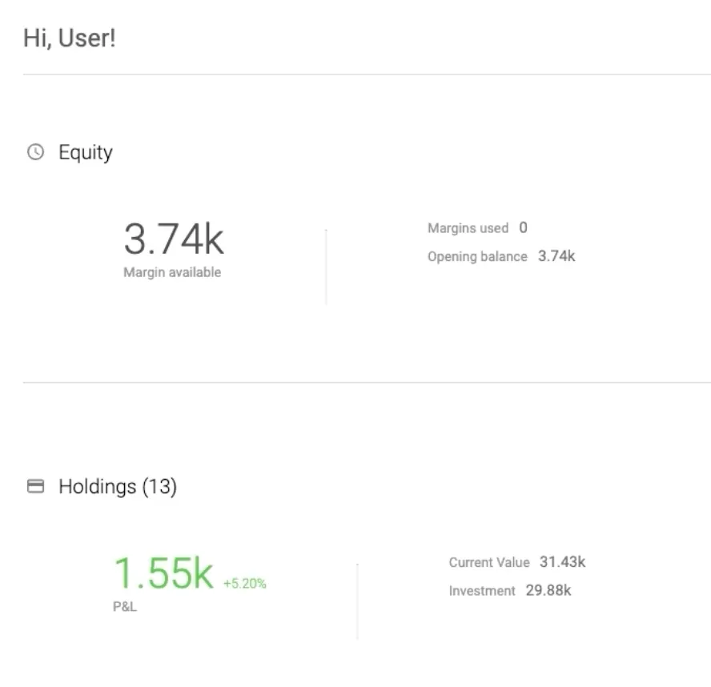

# Zerodha Clone - Stock Trading Platform:

The main zerodha frontend ui is just a medium to use other application like kite, verasity, coin. here we are implementing the kite as a separate react application, which is basically used for trading.

On the left hand side of the kite application we can see our favorite stocks(or rather those stocks which the user is interested in or wants to invest into) which we want to monitor

## Dashboard:

### Equity: 
The Amount which we will see in the Equity is the amount which we can spend to purchase stocks. Basically this is the amount of money one can take from the broker to make additional trades.

But in our case since the margins used shows 0, it means that we have not borrowed any money from broker , rather we have used money from our own account.

margin available is the extra money which we can borrow from the broker, orelse we can use just our own money, which we have done in this screenshot.

so Margin Available=additional borrowing capacity, Total buying power=Margin Available + Your cash.

### Holdings: 

Here we can see the current value being equal to 31.43k , this means that it is the value of my portfolio, meaning the current cummulative market price of all the stocks which i have.

And the investment means the amount which i have spent in order to purchase those stocks, so since my margin used is 0 , that implies that the money which i have used to purchase stocks is from my own cash. So with that the profit which i currently hold is 1.55k which is 5.20% gain from 29.88k.